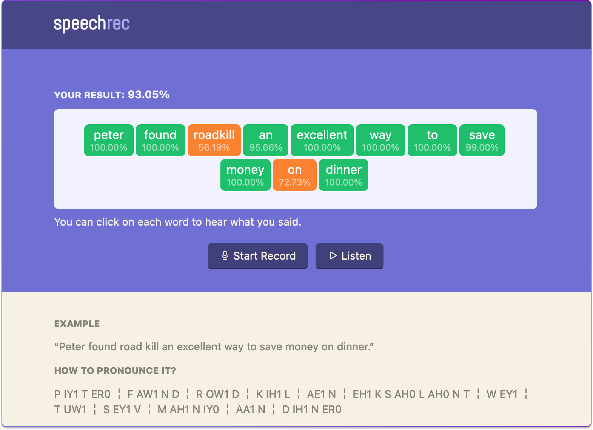

**Speech** is an online voice recorder that checks and helps you improve your pronunciation.

Try it online at: https://speech.sege.dev



## Why did I build this?

As a non-native English speaker, I struggle with my pronunciation a lot. This is a tool I wished I had but could not find it anywhere, so I decided to build it myself.

Or maybe it's just a good excuse for yet another side project.

The code is horrible because it was hacked in a night, I have no excuse for that. I guess it can be improved later.

## How it works?

Under the hood, **Speech** uses [Vosk](https://alphacephei.com/vosk/) – the speech recognition toolkit, to check your voice recording and figure out what you are trying to say.

The audio recording is done using the [Web Audio API](https://developer.mozilla.org/en-US/docs/Web/API/Web_Audio_API), and encoded into WAV format using the [WebAudioRecorder.js](https://github.com/higuma/web-audio-recorder-js) library.

## How to run it locally?

First, you need to download a Vosk model at https://alphacephei.com/vosk/models and extract it to the `model` folder in the source directory.

Then do the thing most JavaScript devs do:

```
$ npm install
$ npm run start
```

## Acknowledge

The speech score provided by this tool is based on the confidence score of each word provided by Vosk's model.

The pronunciation data is provided by [The CMU Pronouncing Dictionary](http://www.speech.cs.cmu.edu/cgi-bin/cmudict).

The speech examples are collected from the [Random Sentence Generator](https://randomwordgenerator.com/sentence.php) website.